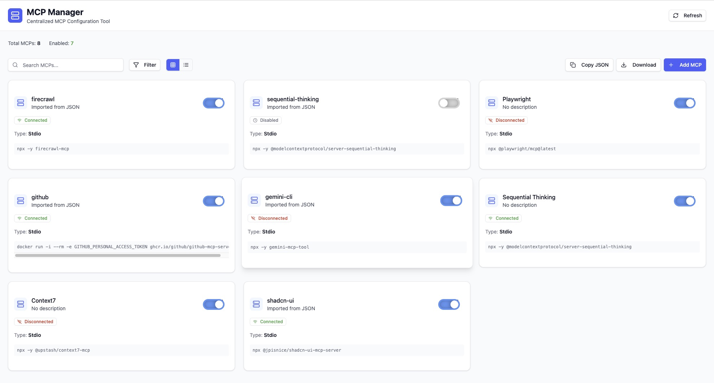

# MCP Manager

> **Centralized MCP Configuration Management Tool for AI Coding Agents**

A powerful npm package that solves the fragmentation problem of MCP (Model Context Protocol) configurations across different AI coding agents like Claude, Gemini, Crush, and OpenCode. Install once, use everywhere with persistent storage across browsers.

## 🎯 Problem Statement

AI coding agents store MCP configurations in different locations and formats:
- **Claude**: `~/.claude/.mcp.json`
- **Gemini**: `~/.gemini/settings.json` 
- **Crush**: `~/.crush/mcps.yaml`
- **OpenCode**: `~/.opencode/config.json`

This fragmentation makes it difficult to:
- ✗ Share MCP configurations between agents
- ✗ Manage MCPs across different projects
- ✗ Keep track of which MCPs are enabled/disabled
- ✗ Test MCP connections

## ✨ Solution



MCP Manager provides a centralized web UI where you can:

- ✅ **Add MCPs** through an intuitive form interface
- ✅ **Enable/disable** MCPs with toggle switches
- ✅ **Export configurations** as JSON for any AI agent
- ✅ **Copy to clipboard** for easy pasting into project `.mcp.json` files
- ✅ **Test connections** to verify MCP functionality
- ✅ **Duplicate & edit** existing configurations
- ✅ **Search & filter** through your MCP collection
- ✅ **Secure storage** with encryption for sensitive environment variables

## 🚀 Quick Start

### NPM Package Installation (Recommended)

```bash
# Install globally
npm install -g @0xraghu/unified-mcp-manager

# Run the app (opens automatically in browser)
mcp-manager

# Or with custom port
mcp-manager --port 8080
```

Your MCP configurations will be stored in `~/.unified-mcp-manager/` and persist across browsers!

### Development Setup

```bash
# Clone the repository
git clone https://github.com/0xRaghu/unified-mcp-manager.git
cd unified-mcp-manager

# Install dependencies
bun install

# Start development server (browser storage)
bun run dev

# Build npm package
bun run build

# Test built package locally
./dist/cli.js --port 3001
```

## 🖥️ Usage

### Adding Your First MCP

1. Click **"Add MCP"** or **"Add First MCP"**
2. Fill out the form:
   - **Name**: Human-readable name (e.g., "GitHub MCP")
   - **Command**: MCP server command (e.g., `npx @modelcontextprotocol/server-github`)
   - **Arguments**: Command arguments (e.g., `--github-token`)
   - **Environment Variables**: Sensitive data like API keys
3. Click **"Add MCP"**

### Managing MCPs

- **Edit**: Click the ⋮ menu → Edit
- **Duplicate**: Create a copy with slight modifications
- **Test Connection**: Verify the MCP server is working
- **Delete**: Remove with confirmation dialog

### Exporting Configurations

- **Copy JSON**: Copies configuration to clipboard
- **Download**: Downloads as `mcp-config.json` file

The exported format is compatible with all major AI coding agents:

```json
{
  "mcpServers": {
    "GitHub MCP": {
      "command": "npx @modelcontextprotocol/server-github",
      "args": ["--github-token"],
      "env": {
        "GITHUB_TOKEN": "your_token_here"
      }
    }
  }
}
```

## 🏗️ Architecture

### Tech Stack

- **Frontend**: React 19 + TypeScript
- **Styling**: TailwindCSS v4 + shadcn/ui
- **State Management**: Zustand
- **Storage**: File-based storage in `~/.unified-mcp-manager/` (npm package) or LocalStorage (dev mode)
- **Server**: Bun.serve() with API endpoints
- **Animations**: Framer Motion
- **Testing**: Playwright (E2E) + Vitest (Unit)
- **Build Tool**: Custom Bun bundler
- **Runtime**: Bun

### Project Structure

```
├── dist/               # Built npm package
│   ├── cli.js          # Main executable
│   ├── server.js       # API server
│   ├── main.js         # Frontend bundle
│   └── lib/            # Storage utilities
├── src/                # React frontend
│   ├── components/     # UI components
│   ├── lib/           # Browser utilities
│   ├── stores/        # State management
│   └── types/         # TypeScript types
├── lib/               # Server-side utilities
│   ├── fileStorage.ts # File system storage
│   └── storageAdapter.ts # Storage abstraction
├── server.ts          # Bun API server
├── cli.ts             # CLI entry point
└── build.js           # Custom build script
```

### Key Features

#### 🔐 Secure Storage
- **NPM Package**: File-based storage in `~/.unified-mcp-manager/`
- **Development**: Browser localStorage with Web Crypto API encryption
- AES-GCM encryption with random salts for sensitive data
- Cross-browser persistence when using npm package

#### 🎨 Modern UI
- Responsive design (mobile, tablet, desktop)
- Dark/light theme support
- Smooth animations with Framer Motion
- Accessible components with proper ARIA labels
- Grid and list view modes for MCP display
- Real-time connection status monitoring
- Comprehensive search and filtering system

#### 🧪 Testing & Connectivity
- 27+ E2E tests with Playwright
- Cross-browser testing (Chrome, Firefox, Safari)
- Unit tests for core functionality
- Live MCP connection testing with status indicators
- Automatic connection health monitoring

#### ⚡ Advanced Features
- Bulk operations for MCP management
- Auto-refresh functionality
- Real-time status updates
- Connection timeout handling
- Comprehensive error handling with user-friendly messages

## 🔧 Development

### Available Scripts

```bash
# Development
bun run dev              # Start dev server (browser storage)
bun run build            # Build npm package
./dist/cli.js            # Test built package locally

# Testing  
bun run test             # Unit tests
bun run test:ui          # Unit tests with UI
bun run test:e2e         # E2E tests
bun run test:e2e:ui      # E2E tests with UI

# Linting
bun run lint             # TypeScript type checking

# Package Testing
bun run build            # Build the package
./dist/cli.js --help     # Test CLI help
./dist/cli.js --port 3001 # Test with custom port
```

### Adding New MCP Types

1. Update `src/types/index.ts` with new MCP properties
2. Update `src/lib/mcpTester.ts` for connection testing logic
3. Add export format support in `src/stores/mcpStore.ts`

## 🧪 Testing Instructions

### Quick Test (Built Package)

```bash
# 1. Build the package
bun run build

# 2. Test CLI help
./dist/cli.js --help

# 3. Start the server (Ctrl+C to stop)
./dist/cli.js --port 3001

# 4. Check storage directory was created
ls ~/.unified-mcp-manager/
```

### Full Testing Workflow

```bash
# 1. Install dependencies
bun install

# 2. Run linting
bun run lint

# 3. Build the package
bun run build

# 4. Test CLI functionality
./dist/cli.js --version
./dist/cli.js --help

# 5. Test server startup
./dist/cli.js --port 3001 &
SERVER_PID=$!

# 6. Test API endpoints
curl http://localhost:3001/api/mcps
curl http://localhost:3001/

# 7. Kill server
kill $SERVER_PID

# 8. Verify storage directory
ls -la ~/.unified-mcp-manager/
```

### Publishing Test

```bash
# 1. Build and test locally
bun run build
./dist/cli.js --port 3002

# 2. Test npm pack (don't publish yet)
npm pack

# 3. Test the packed tarball
tar -tzf *.tgz

# 4. Clean up
rm *.tgz
```

### Contributing

1. Fork the repository
2. Create a feature branch (`git checkout -b feature/amazing-feature`)
3. Make your changes
4. Run tests (`bun run test && bun run test:e2e`)
5. Test the built package (`bun run build && ./dist/cli.js --help`)
6. Commit changes (`git commit -m 'Add amazing feature'`)
7. Push to branch (`git push origin feature/amazing-feature`)
8. Open a Pull Request

## 🤝 MCP Compatibility

### Supported AI Agents

| Agent | Config Location | Format | Status |
|-------|----------------|--------|---------|
| Claude Code | `~/.claude/.mcp.json` | JSON | ✅ Full Support |
| Gemini CLI | `~/.gemini/settings.json` | JSON | ✅ Full Support |
| Crush | `~/.crush/mcps.yaml` | YAML | 🔄 Planned |
| OpenCode | `~/.opencode/config.json` | JSON | ✅ Full Support |

### Popular MCP Servers

The tool supports all standard MCP servers:

- **GitHub**: `npx @modelcontextprotocol/server-github`
- **Filesystem**: `npx @modelcontextprotocol/server-filesystem`
- **SQLite**: `npx @modelcontextprotocol/server-sqlite`
- **Web Search**: `npx @modelcontextprotocol/server-brave-search`
- **Memory**: `npx @modelcontextprotocol/server-memory`

## 🔍 Troubleshooting

### Common Issues

**Q: MCPs not showing up after import**
A: Check that the JSON format matches the expected structure with `mcpServers` as the root key.

**Q: Environment variables not working**
A: Ensure sensitive values are properly encrypted. Check browser console for crypto errors.

**Q: Connection test failing**
A: Verify the MCP server command is correct and all required environment variables are set.

### Debug Mode

Enable detailed logging by adding to localStorage:
```javascript
localStorage.setItem('mcp-debug', 'true')
```

## 📊 Performance

- **Load Time**: < 1s on modern browsers
- **Bundle Size**: < 500KB gzipped
- **Memory Usage**: < 50MB with 100+ MCPs
- **Encryption**: AES-GCM with minimal performance impact

## 🛡️ Security

- **Environment Variables**: Encrypted using Web Crypto API
- **No Network Requests**: All data stored locally
- **XSS Protection**: Input sanitization and CSP headers
- **Type Safety**: Full TypeScript coverage

## 🗺️ Roadmap

### Planned Features
- **Profiles**: Create and manage different MCP configuration profiles for different projects
- **Categorization**: Organize MCPs into categories (Development, Security, Data, etc.)
- **Dark Mode**: Enhanced dark theme with system preference detection
- **Bulk Import**: Add multiple MCP servers at once via JSON file upload
- **Export Formats**: Support for YAML and other configuration formats
- **Backup & Sync**: Cloud backup and synchronization across devices
- **Copy JSON**: Copy the JSON configuration of individual mcps to clipboard for easy pasting into project `.mcp.json` files

### Contributing
We welcome contributions! Pick any roadmap item or suggest new features via GitHub issues.

## 📝 License

MIT License - see [LICENSE](LICENSE) file for details.

## 🙏 Acknowledgments

- [Model Context Protocol](https://modelcontextprotocol.io/) team
- [shadcn/ui](https://ui.shadcn.com/) for beautiful components
- [Radix UI](https://www.radix-ui.com/) for accessible primitives
- [Zustand](https://zustand-demo.pmnd.rs/) for state management

---

**Built with ❤️ for the AI coding community**
